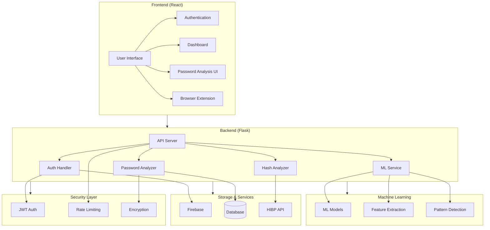
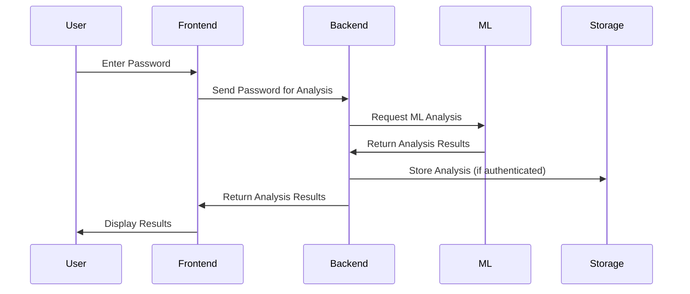
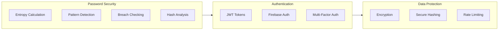
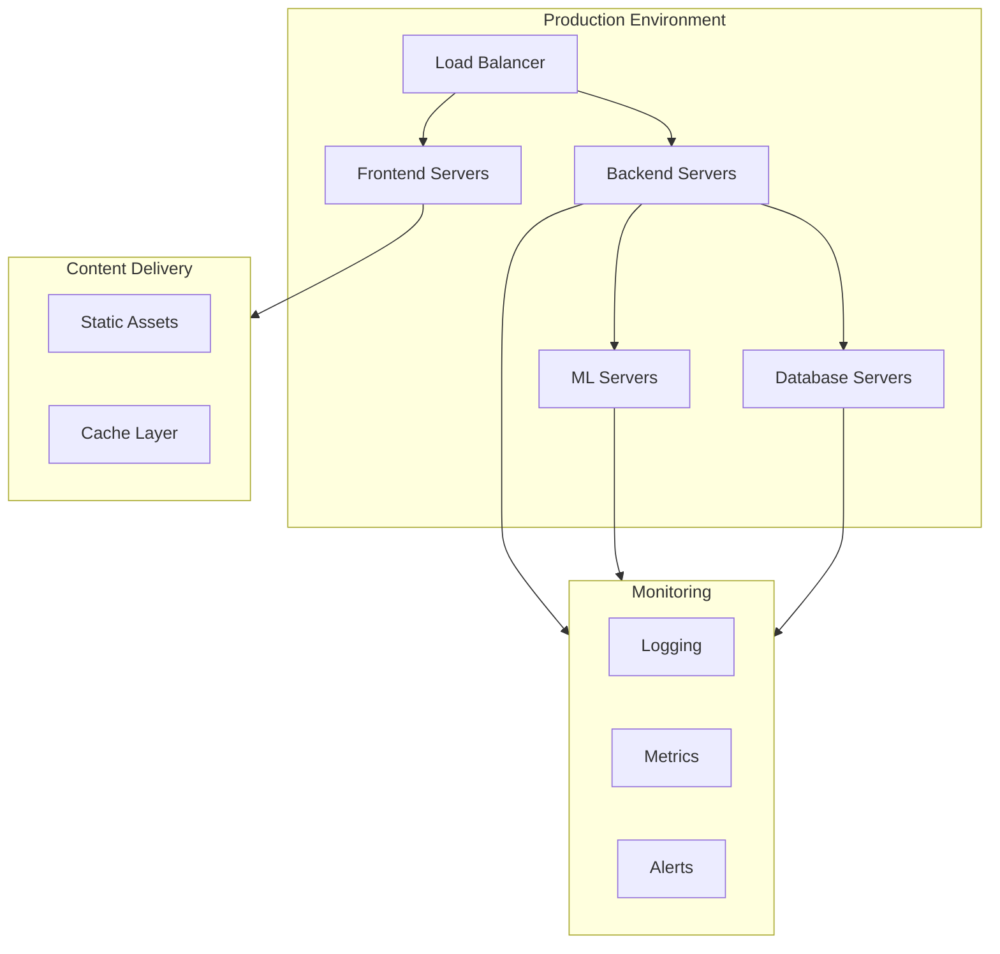

# Breach.AI - Password Security System Architecture

## System Overview

## Component Details

### 1. Frontend Layer
- **User Interface**: React-based responsive web application
- **Authentication**: Firebase Auth integration
- **Dashboard**: Password health monitoring and management
- **Password Analysis UI**: Real-time strength analysis interface
- **Browser Extension**: Chrome extension for password management

### 2. Backend Layer
- **API Server**: Flask-based REST API
- **Auth Handler**: User authentication and authorization
- **Password Analyzer**: Core password strength analysis
- **Hash Analyzer**: Cryptographic hash analysis
- **ML Service**: Machine learning model integration

### 3. Machine Learning Layer
- **ML Models**: Ensemble of models (Gradient Boosting, Random Forest, Neural Networks)
- **Feature Extraction**: Password characteristics analysis
- **Pattern Detection**: Common pattern and vulnerability detection

### 4. Storage & Services
- **Firebase**: Authentication and real-time database
- **Database**: MySQL for persistent storage
- **HIBP API**: Password breach checking service

### 5. Security Layer
- **JWT Auth**: Token-based authentication
- **Rate Limiting**: API request throttling
- **Encryption**: Data encryption at rest and in transit

## Data Flow

## Security Implementation

## Integration Points

1. **Frontend-Backend Integration**
   - REST API endpoints
   - WebSocket for real-time updates
   - JWT authentication

2. **Backend-ML Integration**
   - Model serving
   - Feature extraction
   - Real-time predictions

3. **Storage Integration**
   - Firebase for auth and real-time data
   - MySQL for persistent storage
   - HIBP API for breach checking

4. **Security Integration**
   - JWT token validation
   - Rate limiting middleware
   - Encryption/decryption services

## Deployment Architecture

